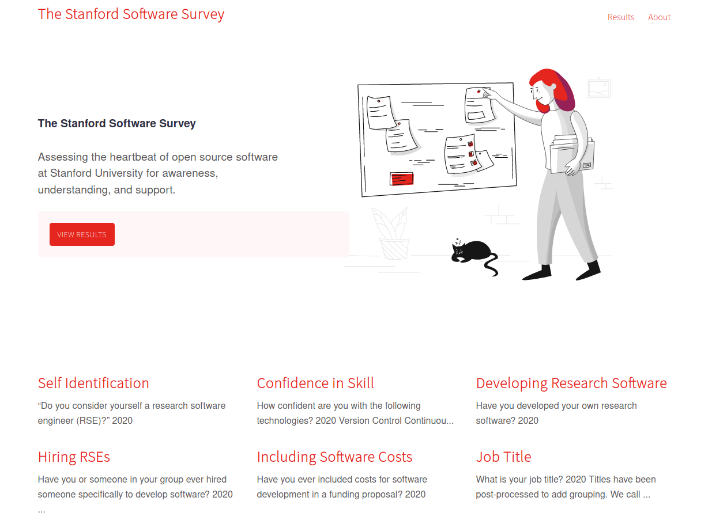
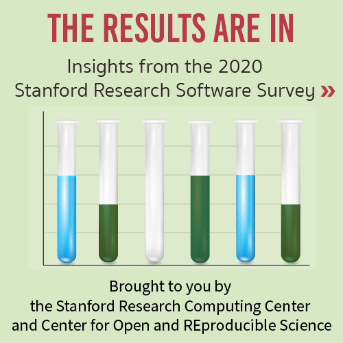

# Stanford Software Survey



This is the Stanford Software Survey started in 2020 by Research Computing (SRCC)
and the Data Sciences Institute (CORES). Results are organized by year in the [_data](_data) folder, 
and will be deployed to an interface on GitHub pages.

 - [Results Data](_data)

**under development**

## Instructions

### 1. Determine Timing

The survey should be sent out on an annual basis, ideally toward the end of the 
year to be announced in the New Year. This means that you should prepare a new Google
Form (connected to a Google Sheet) with the same or a modified set of questions (see [Surveys](#surveys)
for links to all forms). Once the timing is determined, you should of course go ahead and 
create the survey, get feedback, and test it. Testing is important because it's likely
that a question (answers or functionality) might not be as you expect it.

### 2. Distribute

Distribution is best done by way of contacting [UIT Communications](https://itcommunity.stanford.edu/) (Kate Junco)
to have the survey distributed in campus newsletters. Other successful distribution can be done on Slack, and
mailing lists if necessary. You should give participants a month or more to fill out the survey, and with reminders.
In 2020 we did a reward of 5 x $50 gift cards, which can be done with a simple script or assignment of random numbers
and then a roll. For example, in 2020 UIT Communications helped to create this small callout:


that was paired with the following text:

> Are you passionate about open source, or open science? Do you want Stanford to be a larger player in the open source ecosystem? The new Stanford Data Science -  Center for Open and REproducibile Science ([CORES](https://cores.stanford.edu/)) and the [Stanford Research Computing Center](https://srcc.stanford.edu/) are proud to announce the [first annual Stanford Software Survey](https://docs.google.com/forms/d/e/1FAIpQLScnEBcrEwUrrpburRv9VHCBFdtMElrp8CYt-wuUxy4sFIDetg/viewform?usp=sf_link), an effort to showcase open source software used and developed by Stanford University. We invite you to [take the survey](https://docs.google.com/forms/d/e/1FAIpQLScnEBcrEwUrrpburRv9VHCBFdtMElrp8CYt-wuUxy4sFIDetg/viewform?usp=sf_link) for a chance to win $50, and to show your support for open science! Please share the survey with staff, students, faculty, and other affiliates of Stanford. The first step in better supporting open source at the institutional level is understanding it, and we hope that you will take a few minutes to do exactly that!

It's helpful to create a page on [Take 5](https://itcommunity.stanford.edu/take5/participate-stanford-software-survey) to
give the survey a consistent link apart from the Google Form one.

### 3. Award Gift Cards and Close
 
After the period to take the survey finishes, it's important to **turn off result collection** in the Google Form,
and then randomly select 5 participants (one of the last questions) to randomly win a gift card.

#### 4. Add to Survey Site

##### Raw Data
The data can be downloaded as csv, and should be put in the [raw data](_data/raw/) folder named by the year.

##### Cleaned Data
**Optionally** you can go through the original data file and clean up results. For example, you might want to
look through the question "What is your job title?" and update to a common set (e.g., RA == Research Assistant)
so the graph will be cleaner. For example, we did this for 2020 and put the cleaned data under [_data/cleaned](_data/cleaned).

**Importantly** - for both raw and cleaned files, you need to remove the last two questions that collect personal information before
committing to the repository. Also if you update the survey, make sure to update the script accordingly.
Note that the final questions that ask for participant contact information are removed.

##### Prepare Data
Since we need to do a bit of aggregation over values, the next step is to run the data file against
the [scripts/prepare_data.py](scripts/prepare_data.py) to generate the output file. 

```bash
$ python scripts/prepare_data.py _data/cleaned/stanford-software-survey-2020.csv 
Writing output to /home/vanessa/Desktop/Code/stanford-software-survey/_data/stanford-software-survey-2020.json
```

##### Open Ended Questions

The survey (as of 2020) has two open ended questions asking users to share open source software developed and used.
Since these are free text entry, they typically require some manual parsing. You should create data
files (in yaml is easiest) under [_data/software](_data/software) that also can parsed into an equivalent
plot, table, or other visualization appropriate for the data.

##### Embed Results
You should then add a [result](_results) to the `_results` folder, where each file coincides with
a question (e.g., if we have the same question over two years it will be easy to compare the results).
If you have a new question, just create a new page! The original creator @vsoch chose Chart.js, but of course you can
change this plotting library if you like.

#### 5. Share Results!

Finally, make a new post under [_posts](_posts) that follows suit of the other post
to share an announcement for the results. It's a good idea to create a plan to share
the results, again in announcements that might go out to lists, slack channels, etc.
To update the button on the home page to link to the current results, update this
yaml in the [_config.yml](_config.yml):

```yaml
# Link to post with current results to appear at the top of home
current_results: /2021/01/04/two-thousand-twenty/
```

We have an equivalent graphic for sharing results, also beautifully done by UIT
Communications!




## Survey Archive

### 2020

The 2020 survey results can be viewed via [Google Forms](https://docs.google.com/forms/d/1gINZCEin27OQjPLkG4ziVZURRd7NPcZ9szcs1jv0X5U/edit#responses),
and the announcement is found [here](https://itcommunity.stanford.edu/take5/participate-stanford-software-survey).


## Resources and Thanks

 - [color palettes](https://github.com/google/palette.js/blob/master/palette.js#L534) that are used in the plots can be seen here.
 - [jekyll-serif-theme](https://github.com/zerostaticthemes/jekyll-serif-theme)
